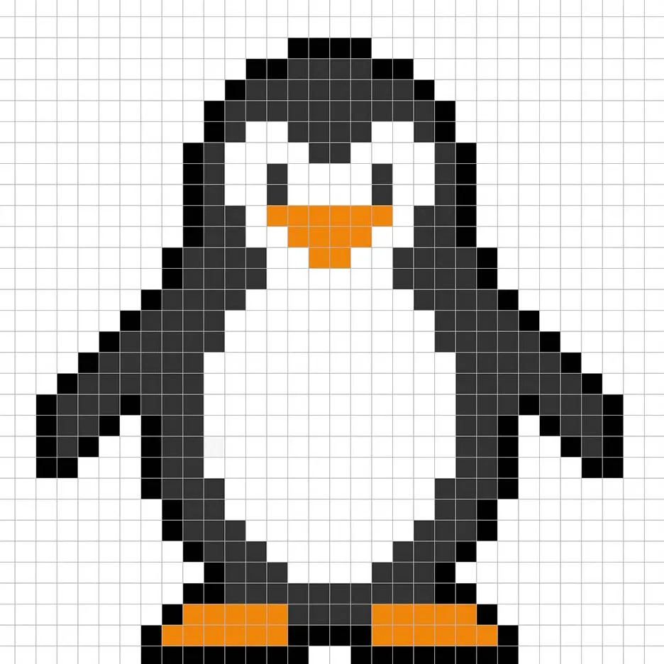
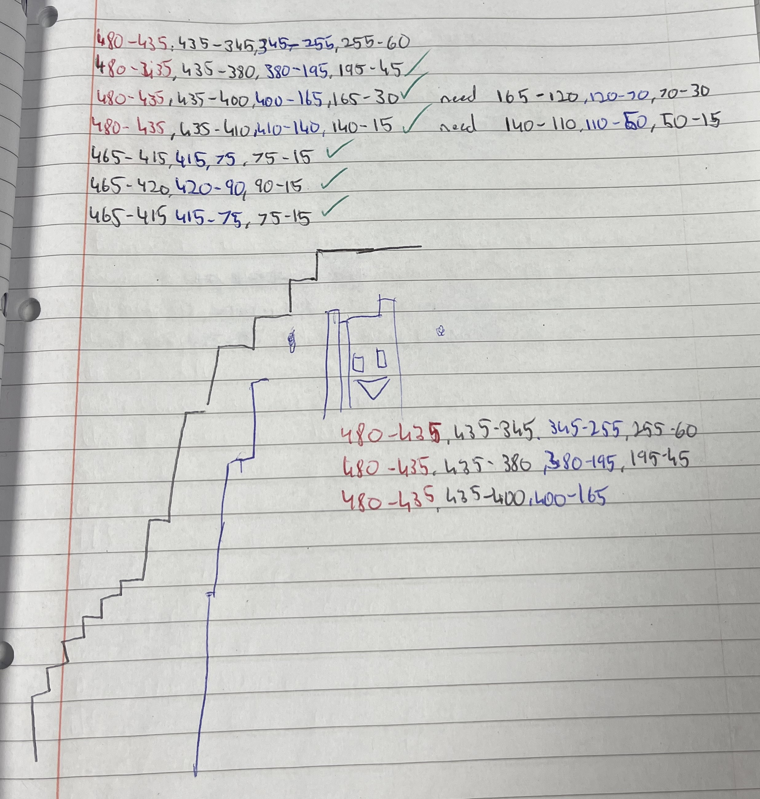
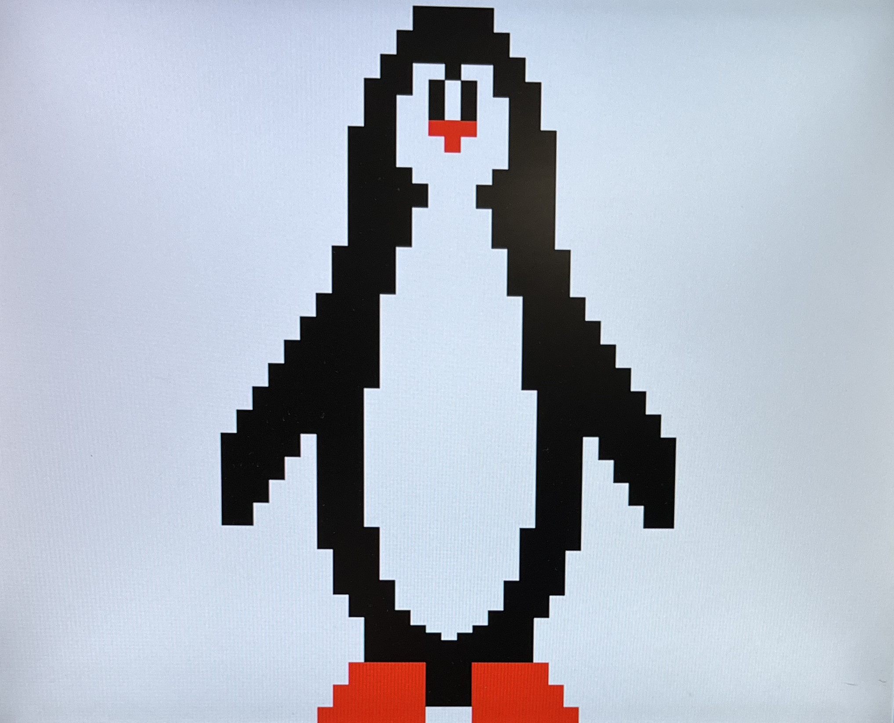
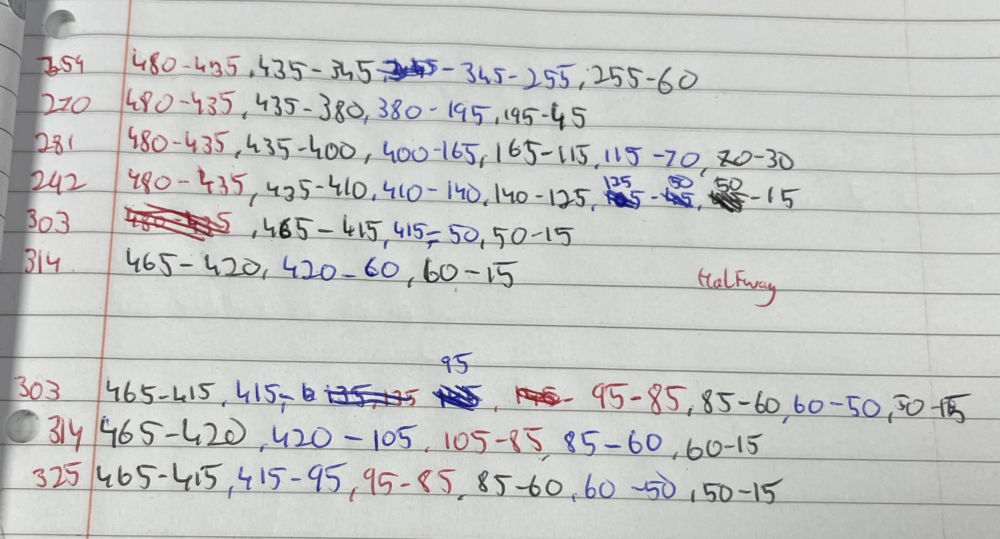

Hello Viewer, My name is Thomas Gallagher and this is my 3rd year FPGA VGA Verilog project. This project's aim was to display a graphic using Vivado Verilog using a Basys 3 Development Board. My creation was an image of a penguin and I will be discussing the development and problems faced developing this project.

## **Project Development**
### **Initial Ideas**
Undertaking this project I had many problems and roadblocks that I had to face and adapt to create a fully functional project. These issues I will be discussing further.

### **ATU Security Updates**
Recently ATU have updated their network security to avoid and prevent hacks which could corrupt the University. However, this has created problems for students as some students are randomly targeted for breaching security protocols which is untrue. I was one of these cases. 

The second lab we had in SOC, I opened my project and changed some code and started to run my Synthesis. While running my Synthesis Vivado shut down and I lost some progress. However, I ran Synthesis two more times and the issue kept occurring. When I consulted with my Lecturer, she gave me different gateways to combat this unwarranted security defence, however, these were warranted ineffective. 

My Lecturer then contacted the lead administrator, who worked alongside me to stop this unwanted defence. 

Three hours after the initial crash we were able to combat the security defence and allow me to start working on my project, however, the lab had finished so I was a week behind already.

 
 

### **Failed Idea's**

As I was a week behind due to the Security measures I had to create and code a design in shorter times than my peers while also creating a project that is unique and complicated, while showing my understanding of the task at hand. 

I decided to create a bouncing DVD logo, that would be a rendition of the old DVD logo when the screen was paused for too long. I was able to create a 50x50 square that changes colour but would just rotate colours not change on a bounce off the screen but the major problem I had was making the square move. I stayed back after classes and late into the evenings researching and applying new techniques, but was unable to move the square.

This lead to the scrapping of this idea. 

 

I also had the idea to make my penguin spin and dance but I was overly ambitious and it was more challenging and time-intensive then initially anticipated. 

## **Template VGA Design**
### **Project Set-Up**
Summarise the project set-up and design flow. Include a screenshot of your own set-up, for example see the image of my Project Summary window below. Guideline 1 short paragraph.

To set up our project we had initially been given code to demonstrate a colour cycle which would rotate between 8 colour cycles. 

### **Template Code**
A template Verilog design code for a Colour Cycle graphic was provided by the Lecturer to demonstrate how to intertwine different aspects of code and functions to create a VGA graphic. The timings and graphics provided display 8 colours displaying for a second each before repeating. The example code included VGATop.v, VGASync.v and VGAColourCycle.v, which are the design sources, Testbench.v was provided which was used in our simulation sources. Basys3_Master.xdc was also provided as it is needed to run code on a Basys3 development board. These example codes were the bases for developing my project.

This ColourCycle project provided uses a state machine which changes states every half second. Included in the ColourCycle code it shows us how to create each colour available to us. This includes Black, Red, Yellow, Green, Cyan, Blue, Magenta and White, which are all made possible due to VGARed, VGAGreen and VGABlue. 

### **Simulation** 

### **Synthesis**

Synthesis converts the high-level software code into netlists needed to create hardware logic. The image below is showing what type netlists are needed to create the ColourCycle graphic.

### **Demonstration**
As you can see with the video below, the project was a success and it rotated between each colour and reset and rotated again as intended.

## **My VGA Design Edit**
I created a penguin designed based on design ideas I researched online and found a YouTube video demonstrating a spinning penguin. I then researched images of pixelated penguins to adapt and base my graphic on. Using the ColourStripes.v code given to us by our Lecturer, I was able to understand and manipulate the code to be able to display the graphic. 

This code had me columns of white and black pixels and manipulate the areas the which needed other colours using the rows function to display white and red lines of pixels to create this image. 

YouTube video = "FPGA VGA output implement" by TaoTao
https://www.youtube.com/shorts/Bjjqv0e9A6A

### **Code Adaptation**
Using the ColourStripes.v code block I was able to create an understanding of the design layout, for example by manipulating either of the three colour blocks, red, blue and green, it would create another colour. If I change each line to all zero's it would create a black graphic and if I change them to all one's it would create a white graphic.

Using this knowledge and I was able to understand how the columns and rows work. If I wanted to display eight colours in stripes I would need to divide the columns by 8, so thats 8 into 640 which would be 80 pixels wide per graphic. This was evident in the ColourStripes.v code given to us. However, to understand how to implement rows into the function was tricky to understand but I had managed to figure it out.

For example if I wanted to display a small 15x15 white pixel square in the top left corner, I would first create a white column of that size and then create a row to stop end of the column.

This is the code shown:

if(col >= 11'd0 && col <11'd15 && row >= 11'd0 && row < 11'd15)
begin
red_next   <= 4'b1111;
green_next <= 4'b1111;
blue_next  <= 4'b1111;
end

### **Synthesis**

The code had created many gates to be able to produce the necessary three VGA colours for synthesis, which are VGARed, VGAGreen, VGABlue.

 

Vivado was smart enough to figure out I was only using White, Red and Black as my colour schemes so it created a chip for creating Red on its own, and also created a VGAGreen chip as it reads in the VGAGreen and VGABlue missing which is needed to initialize the colour black. 

### **Demonstration**
After a long task I was able to completely understand the code needed to code the columns and rows needed to display the Penguin. For example Column 303, I had to code the row into 6 seperate blocks.
465-415 Black, 415-95 White, 95-85 Red, 85-60 Black, 60-50 White and 50-15 Black

